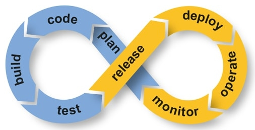

# CI/CD

The lean/agile methodology (`See`: [Twelve Principles of Agile Software](https://agilemanifesto.org/principles.html)) is now widely used by the industry and one of its key principles is to iterate as fast as possible. If you apply this to software engineering, it means that you should:

  * code
  * ship your code
  * measure the impact
  * learn from it
  * fix or improve it
  * start over

As fast as possible and with small iterations in days or even hours (whereas it used to be weeks or even months). One big advantage is that if product development is going the wrong direction, fast iteration will allow to quickly detect this, and avoid wasting time.

From a technical point of view, quicker iterations mean fewer lines of code being pushed at every deploy, which allows easy performance impact measurement and easy troubleshooting if something goes wrong (better to debug a small code change than weeks of new code).

Applied to software engineering, [CI/CD](https://digital.ai/catalyst-blog/walk-before-you-run-understanding-ci-in-cd/) (Continuous Integration/Continuous Deployment) is a principle that allows individuals or teams to have a lean/agile way of working.

This translates to a “shipping pipeline” which is often built with multiple tools such as:

  * Shipping the code:
    * Capistrano, Fabric
  * Encapsulating the code
    * Docker, Packer
  * Testing the code
    * Jenkins, CircleCi, Travis
  * Measuring the code
    * Datadog, Newrelic, Wavefront